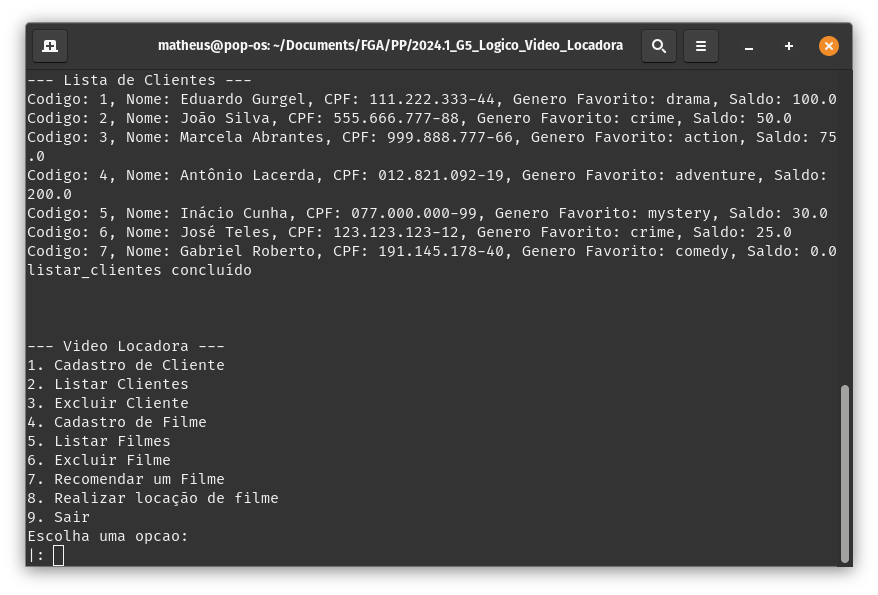
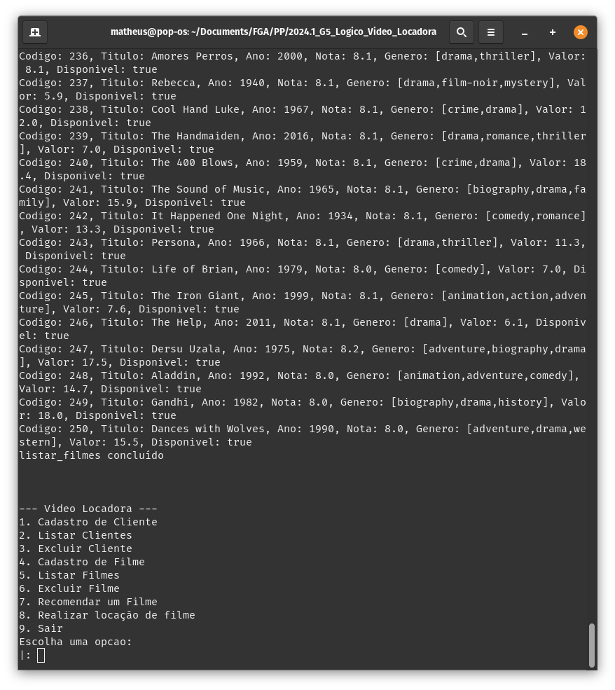
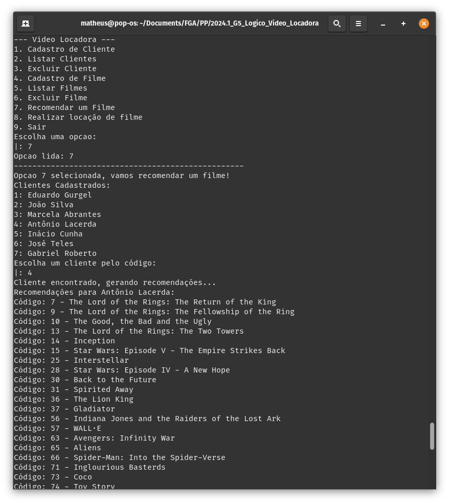
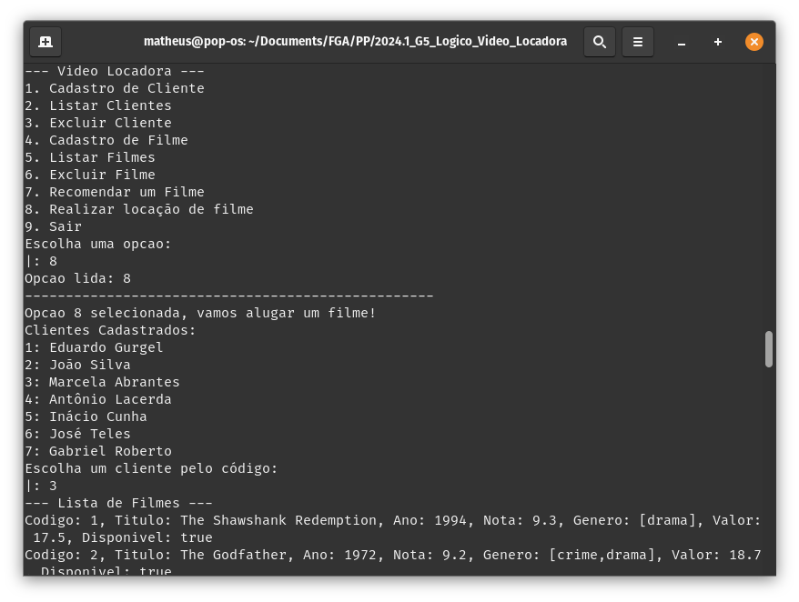
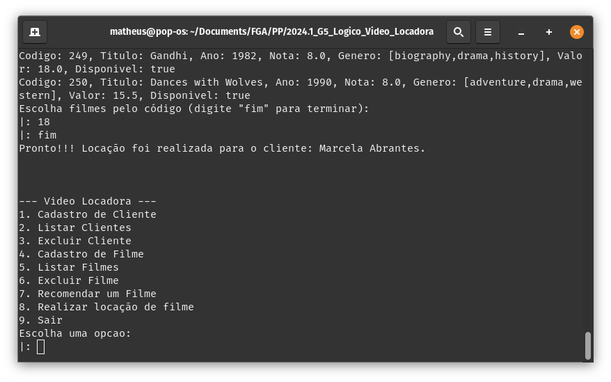

# Vídeo Locadora

Paradigma:
 - Lógico
   
**Disciplina**: FGA0210 - PARADIGMAS DE PROGRAMAÇÃO - T01  
**Nro do Grupo (de acordo com a Planilha de Divisão dos Grupos)**: 05 
**Paradigma**: Lógico 

## Alunos
|Matrícula | Aluno |
| -- | -- |
| 19/0113596  |  Charles Manrique Serafim Morais |
| 19/0045485  |  Eduardo Gurgel Pereira de Carvalho |
| 19/0125829  |  Ian da Costa Gama |
| 19/0134623  |  Marcos Diego da Silva Gomes |
| 19/0058587  |  Matheus Raphael Soares de Oliveira |
| 14/0158278  |  Pedro Helias Carlos  |
| 21/1006957  |  Sebastián Héctor Zuzunaga Rosado  |
| 19/0117508  |  Thiago Cerqueira Borges  |

## Sobre 
O Projeto de Video Locadora em Prolog é uma aplicação desenvolvida como parte da disciplina de Paradigmas de programação na Universidade de Brasília. Essa aplicação permite gerenciar o aluguel e devolução de filmes em uma locadora fictícia.
  
Alguns dos recursos incluem:
- **Cadastro de Usuários:** O sistema permite o cadastro de usuários. Cada usuário pode fornecer informações como nome, CPF, saldo disponível na conta da locadora e sua preferência em gênero de filmes. Esses dados são armazenados para gerenciar os aluguéis, devoluções e recomendações.
- **Cadastro de Filmes:** Além de usuários, o sistema permite o cadastro de filmes. Ao adicionar um filme, você pode especificar detalhes como título, gênero, ano e nota. Isso torna a busca e seleção de filmes mais completa.
- **Processo de Aluguel de Filmes**: Filmes podem ser selecionados e associados ao usuário. Na existência de saldo disponível, há um débito relacionado a soma dos valores dos filmes e, por fim, o aluguel do filme é realizado.
- **Recomendação de Filmes:** Para melhorar a experiência dos usuários, o sistema oferece recomendações personalizadas. Com base nas preferências de filmes de um usuário, ele receberá sugestões de outros filmes semelhantes em gênero.
    - **Exemplo de Recomendação:** Suponha que um usuário tenha alugado o filme “Matrix”. O sistema pode recomendar filmes como “Blade Runner” ou “Inception”, já que todos esses são filmes dos gêneros Ação e Ficção Científica.

## Screenshots

*Primeira imagem: Demonstração do resultado da função Lista Clientes*

*Segunda imagem: Demonstração do resultado da função Lista Filmes*

*Terceira imagem: Resultado da função de Recomendação de Filmes, para um usuário que gosta de filmes de Aventura*

*Quarta e quinta imagens: Demonstração do processo de locação de um filme para o usuário Marcela Abrantes*

## Instalação 
**Linguagens**: Prolog 
### Windows
#### 1. Download do SWI-Prolog
Acesse o site oficial do SWI-Prolog: [SWI-Prolog Download](https://www.swi-prolog.org/download/stable).
Clique no link para a versão do Windows e faça o download do instalador.
#### 2. Instalação do SWI-Prolog
Após o download, abra o arquivo do instalador (swipl-windows.exe ou similar).
Siga as instruções do instalador. As opções padrão geralmente são suficientes, então você pode simplesmente clicar em "Next" em cada etapa.
Clique em "Install" e, após a conclusão, clique em "Finish".
#### 3. Configuração do Ambiente
Após a instalação, você pode abrir o SWI-Prolog de duas maneiras:
Via Menu Iniciar: Procure por "SWI-Prolog" no menu Iniciar do Windows e clique no ícone para abrir a interface gráfica.
Via Linha de Comando: Abra o Prompt de Comando e digite swipl, então pressione Enter para abrir o intérprete do Prolog no modo texto.

### Linux
No Linux, você pode instalar o SWI-Prolog usando o gerenciador de pacotes da sua distribuição.
 
1 - `sudo apt-get update`
 
2 - `sudo apt-get install swi-prolog`

## Uso 
Depois de instalar o SWI-Prolog, você pode executá-lo a partir da linha de comando.

Abra o terminal (ou o Prompt de Comando no Windows).
 
1 - Digite `swipl` e pressione Enter.
 
2 - Execute o programa digitando `[locadora].`
 
3 - Siga as instruções dadas no menu para a utilização do programa.

## Vídeo

[link para o vídeo](https://youtu.be/bWYhc8Ou-Ec)

## Participações
|Nome do Membro | Contribuição | Significância da Contribuição para o Projeto (Excelente/Boa/Regular/Ruim/Nula) |
| -- | -- | -- |
| Charles Manrique Serafim Morais | Não atuou | nula |
| Eduardo Gurgel Pereira de Carvalho | Cadastro de Cliente, Listar Clientes, Excluir Cliente, Cadastro de Filme, Listar Filmes, Excluir Filme | Excelente |
| Ian da Costa Gama | | |
| Marcos Diego da Silva Gomes | Revisão, identificação de possíveis problemas e correções do código principal, inclusão e modificação da base de fatos de filmes e clientes juntamente de sua manipulação em arquivo externo | Boa |
| Matheus Raphael Soares de Oliveira  |  Ajuste na formatação dos fatos dos clientes e composição do README | Regular |
| Pedro Helias Carlos | Revisão final do projeto, atuação na parte de Recomendação de Filme, Aluguel de Filme, organização do menu e do time. | Excelente |
| Sebastián Héctor Zuzunaga Rosado | Apoio à criação da função de localização e recomendação; criação de função para histórico de aluguel e devolução de filme. | Boa |
| Thiago Cerqueira Borges | Pesquisa sobre dataset, adaptação e automatização na transformação dos dados usando Python de CSV para Prolog e criação das estrutura dos dados em prolog | Boa |

## Outros 

### Lições Aprendidas e Percepções
- Prática do conhecimento adquirido sobre Prolog, construindo um programa de Locação de Filmes com um sistema de recomendação baseado nas preferências dos usuários
- Praticidade do paradigma lógico ao utilizar funções de busca em Prolog
- Criação e manipulação de arquivos
- Manipulação dos fatos do sistema utilizando os predicados
- Utilização do dynamic

### Contribuições
- União do grupo em relação as ideias relacionadas ao projeto
- Divisão de partes do projeto e auxílio em fontes de conhecimento para aprendizagem
- Trabalho em subgrupos por modalidade do projeto, facilitando a aprendizagem e o entendimento do código
- Integração do projeto e adaptação dos códigos das partes.

### Fragilidades
- Falta de interface gráfica mais elaborada
- Validação constante de dados durante cadastro na base de fatos
- Ausência de alguns membros na reunião geral e um membro, em específico, ausente em todos os processos dessa entraga.

### Trabalhos Futuros
- Aprimorar a interface do usuário
- Validar os dados durante cadastros
- Melhorias no algoritmo de recomendação

## Fontes
- [**SWI-Prolog Reference Manual**](https://www.swi-prolog.org/pldoc/doc_for?object=manual): Documentação oficial do SWI-Prolog, incluindo detalhes sobre a linguagem e suas funcionalidades.
- [**Prolog Tutorial (TutorialsPoint):**](https://www.tutorialspoint.com/prolog/index.htm) Tutorial online que cobre uma ampla gama de tópicos sobre Prolog.
- [**An Efficient Movie Recommendation Algorithm**](https://hcis-journal.springeropen.com/articles/10.1186/s13673-018-0161-6): Artigo apresenta um algoritmo de recomendação de filmes que utiliza o método de k-clique para agrupar usuários com características semelhantes.
- [**Lista de vídeos de Prolog**](https://www.youtube.com/watch?v=x_ahRnd1gTI&list=PLZ-Bk6jzsb-OScKa7vhpcQXoU2uxYGaFx): Lista de vídeos no YouTube sobre Prolog em português.
